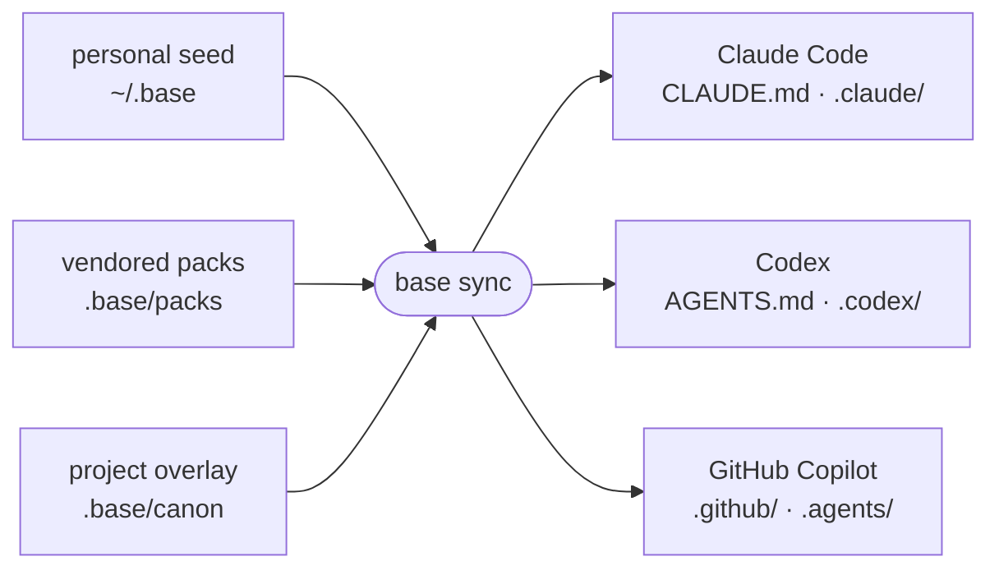

# Base

**One operating model. Every harness. Plain files in git.**

Base is a repository operating-model core for Claude Code, Codex, and GitHub Copilot. Define your
rules, agents, skills, pipelines, lifecycle policies, verifier suites, and knowledge once; Base
compiles them into each harness's native project surfaces. Work, runs, evidence, decisions, and
handoff state stay as plain files in git. **Base does not run an agent loop** — the CLI composes,
validates, renders, gates, verifies, and records; your harness owns the model.

- 🧩 **One canon, native adapters** — author once, render to Claude, Codex, and Copilot.
- 📂 **Git is the substrate** — definitions, packs, work, runs, and evidence are diffable files.
- 🔒 **Lifecycle, not inference** — gates, verifiers, and hooks with typed, honest outcomes.
- 📦 **Reusable packs** — versioned, hash-pinned operating models adopted by copy.

---

## How it works

Base compiles one vendor-neutral **canon** — composed from your personal seed library, versioned
**packs**, and a project **overlay** (which wins last) — into each harness's native project files.
Run `base sync` and the same definitions render three ways:



Composition is deterministic: global seed canon, then configured packs in declaration order (later
IDs win), then the project overlay wins last. Only repository-resident pack and project definitions
render into committed output. Where a target cannot express a definition natively, Base **reports**
the reduced fidelity instead of hiding it — see the [adapter fidelity matrix](docs/ADAPTERS.md).

---

## Install

The repository pins and declares Rust 1.93.0; that is the toolchain used by the shipped proof.

```console
cargo install --path .
base --help
```

Install the same `base` binary in every local and remote agent environment that needs generated
hooks. Static instructions, agents, and skills remain usable without it, but lifecycle enforcement
cannot run.

---

## Quickstart

Initialize the user-wide library once, then set up a repository and adopt the reusable delivery
operating model:

```console
base init --global          # install the bundled software-delivery pack into ~/.base
cd your-project
base init --project         # scaffold .base/ in this repository
base adopt software-delivery  # vendor an immutable, hash-pinned copy into .base/packs/
base check                  # validate composition and report adapter fidelity
base sync                   # compile canon into each harness's native surfaces
```

Then invoke the generated delivery pipeline from your harness:

| Harness | Invocation |
|---|---|
| Claude Code | `/delivery <task>` |
| Codex | mention `$delivery` with the task |
| GitHub Copilot (CLI / cloud) | mention `$delivery` with the task |
| GitHub Copilot (VS Code) | run `.github/prompts/delivery.prompt.md` |

**Add your own definitions** under `.base/canon/`; never edit managed pack bytes or generated
output. Refresh only Base-bundled library packs with `base init --global --packs-only --force` —
that scope never rewrites personal seed canon. Treat third-party packs as code: review their policy
and verifier commands before adoption or upgrade.

> **Adopting into an existing repo** that already owns `CLAUDE.md`, `AGENTS.md`, or Copilot
> instruction files? Move target-specific material into `.base/native/` before the first sync, and
> prefer promoting portable rules into `.base/canon/`. See the
> [canon contract](docs/CANON.md#native-migration-overlays) for the merge rules.
>
> **Upgrading a Base v0.1 project?** Follow the ordered, one-operator procedure in
> [docs/UPGRADING.md](docs/UPGRADING.md) — do not ask the v0.1 binary to migrate itself.

---

## Commands

Eleven verbs, single Rust binary. Every command accepts `--json`.

| Command | Job |
|---|---|
| `base init [--global\|--project] [--packs-only] [--force]` | scaffold the global library or a project, or refresh only bundled packs |
| `base sync [--check] [--force]` | compile canon to active targets; stamp or verify generated hashes |
| `base check` | validate composition and report gate plus definition-surface fidelity |
| `base adopt <pack> [--upgrade]` | vendor or safely upgrade an immutable versioned pack |
| `base ingest <path> [--run]` | read another system's harness surfaces into a portable inventory and mapping report |
| `base pack <new\|check>` | scaffold a library pack skeleton or validate a drafted pack |
| `base work <list\|new\|show\|move\|board>` | manage folder-backed work items and the kanban board |
| `base state <show\|set\|clear\|context>` | manage current work and emit portable session context |
| `base verify <suite> [--run]` | execute typed verifier checks and optionally retain evidence |
| `base approve <run> <gate> [--deny] [--by] [--note]` | write a create-new operator stage-gate verdict |
| `base log [<slug>]` | inspect run history or one run folder |

`base sync --check` validates canon and fails when generated output is missing, stale, hand-edited,
or no longer matches the manifest. Generated UTF-8 text is hash-compared after CRLF-to-LF
normalization, so Git checkout policy never creates false cross-platform drift; non-UTF-8 resources
stay byte-exact.

Verifier suites run direct-argv checks in an isolated process group / Windows Job Object with
timeouts. Their only verdicts are `pass`, `fail`, and `inconclusive` — a missing executable or
timeout is never coerced into success. `--run` retains the JSON report under the run's
`evidence/verifications/` folder.

---

## Anatomy of a Base project

Everything Base owns lives under `.base/`. Canon composes deterministically; state, work, and
evidence accumulate as plain files.

```text
~/.base/                     personal seed library
  canon/packs/<id>/          versioned pack library

<repo>/.base/
  base.toml                  targets, gates, packs, generated hashes
  packs/<id>/                immutable repository-vendored packs
  native/                    allowlisted target-native migration overlays
  canon/                     project overlay — wins last by canonical ID
    agents/                  portable roles and access posture
    skills/<id>/SKILL.md     project Agent Skills plus resources
    pipelines/               reusable staged workflows
    policies/                lifecycle hook contracts
    verifiers/               executable verification contracts
    knowledge/               project-tier lessons
  state/current-work         pointer to an existing W-NNNN item
  state/handoff.md           validated handoff bound to a work item and run
  work/                      work-item folders plus .ids/ team reservations
  runs/                      run artifacts and retained evidence
  history.jsonl              append-only run ledger
```

Repository hooks are workflow controls, not an authorization boundary. Base reports their runtime,
trust, and product-profile prerequisites; protect the default branch in your Git host for the
authoritative server-side boundary.

---

## Documentation

| Document | Answers |
|---|---|
| [docs/SPEC.md](docs/SPEC.md) | What is the shipped v0.2 architecture contract? |
| [docs/CANON.md](docs/CANON.md) | How do I author each canon kind, pack, and native overlay? |
| [docs/ADAPTERS.md](docs/ADAPTERS.md) | What surface and fidelity does each harness get? |
| [docs/UPGRADING.md](docs/UPGRADING.md) | How do I migrate a Base v0.1 project to v0.2? |
| [docs/DECISIONS.md](docs/DECISIONS.md) | Why is Base built this way? (append-only decision log) |

Start at the [documentation index](docs/README.md) for a guided path through them.

---

## Development

Base dogfoods its own operating model: this repository is a Base project, so `CLAUDE.md`,
`AGENTS.md`, `.claude/`, `.codex/`, `.github/`, and `.agents/` are **generated by `base sync`** —
never edit them by hand.

```text
src/                    Rust CLI: compose, sync, verify, gate (hand-edited)
tests/                  spec tether + CLI integration tests
docs/                   architecture spec, canon contract, adapters, decisions
assets/packs/           bundled software-delivery pack installed by base init
.base/                  this repository's own Base project (dogfooded)
CLAUDE.md               GENERATED — never edit
AGENTS.md               GENERATED — never edit
.claude/                GENERATED — Claude Code surfaces
.codex/                 GENERATED — Codex surfaces
.github/                GENERATED — Copilot surfaces
.agents/skills/         GENERATED — shared Codex/Copilot skills
```

Run the full local proof before pushing:

```console
cargo fmt --all -- --check
cargo clippy --all-targets --all-features -- -D warnings
cargo test --all-targets --all-features
base sync --check
```
