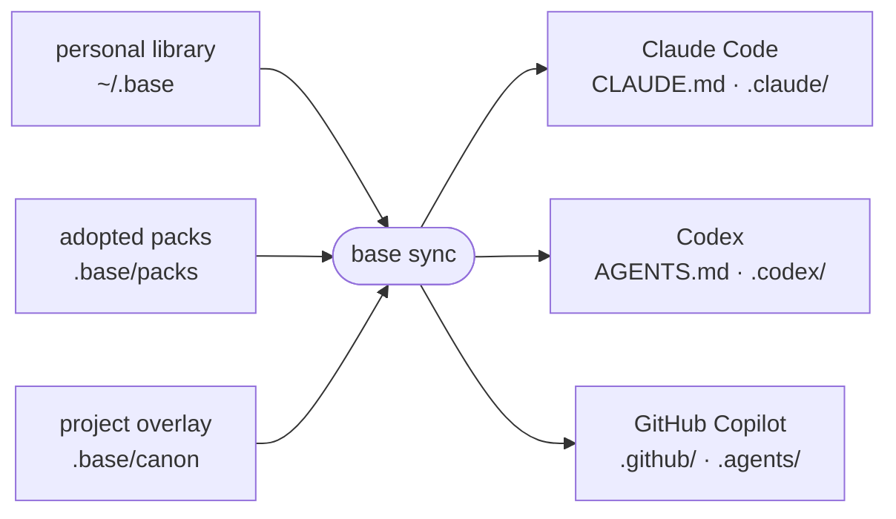

# Base

**Describe your team's way of working once. Base compiles it into the native setup of every AI
coding agent.**

[Quick start](#quick-start) · [How it works](#how-it-works) · [Commands](#commands) ·
[Project layout](#project-layout) · [Docs](#documentation)

## The problem

Every agent harness ships its own configuration format. Your rules get copy-pasted across
`CLAUDE.md`, `AGENTS.md`, and Copilot instructions — then drift apart. Nothing enforces your
process, no two tools behave the same, and every session starts from zero context.

Base fixes this. You define rules, agents, skills, pipelines, policies, and verifiers in one
place; Base compiles them into each harness's native project files. Work items, run history, and
evidence stay as plain, diffable files in git.

- **Author once, render everywhere** — one set of definitions, three native targets: Claude Code,
  Codex, and GitHub Copilot.
- **Git is the database** — definitions, work items, runs, and evidence are reviewable files, not
  a hosted service.
- **Enforcement with honest outcomes** — gates, hooks, and verifiers report `pass`, `fail`, or
  `inconclusive`; a missing tool is never quietly treated as success.
- **Reusable starting points** — versioned packs you adopt by copy, including a bundled
  software-delivery operating model.

Base does not run an agent loop — your harness owns the model. Base is the CLI that composes,
validates, renders, gates, verifies, and records.

## Quick start

Requires Rust 1.93 (pinned in `rust-toolchain.toml`).

```console
cargo install --path .        # from a clone of this repository
cd your-project
base start                    # one command: scaffold, adopt the delivery pack, validate, sync
```

`base start` creates `~/.base/` (your personal library), scaffolds `.base/` in the repository,
adopts the bundled `software-delivery` pack, validates everything, and generates:

| Harness | What Base writes |
|---|---|
| Claude Code | `CLAUDE.md`, `.claude/` |
| Codex | `AGENTS.md`, `.codex/` |
| GitHub Copilot | `.github/`, `.agents/skills/` |

Then start a delivery pipeline from your harness:

| Harness | Invocation |
|---|---|
| Claude Code | `/delivery <task>` |
| Codex | mention `$delivery <task>` |
| Copilot (CLI / cloud) | mention `$delivery <task>` |
| Copilot (VS Code) | run `.github/prompts/delivery.prompt.md` |

Rerunning `base start` is safe — it reports what changed instead of redoing work.

> [!TIP]
> Adding Base to a repo that already has `CLAUDE.md` or `AGENTS.md`? Use
> `base start --migrate-native`: existing files move byte-for-byte into `.base/native/` and are
> composed into the generated output instead of being overwritten. Prefer promoting portable rules
> into `.base/canon/` — see [the canon contract](docs/CANON.md#native-migration-overlays).

### Define your own system

Scaffold any building block with valid frontmatter, then compile it:

```console
base canon new rule no-secret-commits     # also: agent, skill, stage, pipeline,
                                          # policy, verifier, knowledge
base canon list                           # see everything composing today, by source
base check && base sync                   # validate and render to all harnesses
```

> [!IMPORTANT]
> Never edit managed pack bytes under `.base/packs/` or generated files like `CLAUDE.md` — change
> the source under `.base/canon/` and rerun `base sync`. Treat third-party packs as code: review
> their policy and verifier commands before adopting them.

Upgrading a Base v0.1 project? Follow [docs/UPGRADING.md](docs/UPGRADING.md).

## How it works

Definitions compose in a fixed order — personal library first, then adopted packs, then the
project overlay wins last — and `base sync` renders them into each harness natively:


```mermaid
flowchart LR
  seed["personal library<br/>~/.base"]
  packs["adopted packs<br/>.base/packs"]
  overlay["project overlay<br/>.base/canon"]
  sync(["base sync"])
  claude["Claude Code<br/>CLAUDE.md · .claude/"]
  codex["Codex<br/>AGENTS.md · .codex/"]
  copilot["GitHub Copilot<br/>.github/ · .agents/"]
  seed --> sync
  packs --> sync
  overlay --> sync
  sync --> claude
  sync --> codex
  sync --> copilot
```

Where a target cannot express something natively, Base reports the reduced fidelity rather than
hiding it — the [adapter matrix](docs/ADAPTERS.md) says exactly what each harness gets.

Everything else accumulates as plain files under `.base/`: current work, handoffs between
sessions, run folders with retained evidence, and an append-only history ledger.

> [!NOTE]
> Hooks are workflow guardrails, not security boundaries. Protect your default branch at the Git
> server — that is the authoritative control.

## Commands

Thirteen verbs, one binary. Every command accepts `--json`.

| Command | Job |
|---|---|
| `base start [--pack] [--no-pack] [--migrate-native] [--force]` | onboard a repo in one step |
| `base init [--global\|--project] [--packs-only] [--force]` | scaffold the global library or a project |
| `base canon <new\|list> [--pack <id>]` | scaffold a definition; list what composes today |
| `base sync [--check] [--force]` | compile canon to active harness surfaces |
| `base check` | validate composition and report adapter fidelity |
| `base adopt <pack> [--upgrade]` | vendor or upgrade an immutable versioned pack |
| `base ingest <path> [--run]` | inventory another system's harness files for migration |
| `base pack <new\|check>` | scaffold or validate a library pack |
| `base work <list\|new\|show\|move\|board>` | manage work items on a kanban board |
| `base state <show\|set\|clear\|context>` | manage current work and session context |
| `base verify <suite> [--run]` | run verifier checks and retain evidence |
| `base approve <run> <gate> [--deny] [--by] [--note]` | record an operator gate verdict |
| `base log [<slug>]` | inspect run history |

`base sync --check` fails when any generated file is missing, stale, or hand-edited, so CI and
pre-push checks can catch drift. Verifier suites run commands with timeouts in an isolated process
group; their only verdicts are `pass`, `fail`, and `inconclusive`.

## Project layout

```text
~/.base/                     personal seed library
  canon/packs/<id>/          versioned pack library

<repo>/.base/
  base.toml                  targets, gates, packs, generated hashes
  packs/<id>/                immutable repository-vendored packs
  native/                    migrated harness-specific files (composed on sync)
  canon/                     project overlay — your definitions, wins last
    agents/                  roles and access posture
    skills/<id>/SKILL.md     Agent Skills plus resources
    pipelines/               staged workflows
    policies/                lifecycle hook contracts
    verifiers/               executable verification contracts
    knowledge/               project lessons
  state/current-work         pointer to the active W-NNNN item
  state/handoff.md           validated handoff bound to a work item and run
  work/                      work-item folders plus team ID reservations
  runs/                      run artifacts and retained evidence
  history.jsonl              append-only run ledger
```

## Documentation

| Document | Answers |
|---|---|
| [docs/SPEC.md](docs/SPEC.md) | What is the shipped v0.2 architecture contract? |
| [docs/CANON.md](docs/CANON.md) | How do I author each kind of definition? |
| [docs/ADAPTERS.md](docs/ADAPTERS.md) | What surface does each harness get, and where is fidelity reduced? |
| [docs/UPGRADING.md](docs/UPGRADING.md) | How do I migrate a v0.1 project? |
| [docs/DECISIONS.md](docs/DECISIONS.md) | Why is Base built this way? |

Start at the [documentation index](docs/README.md) for a guided path.

## Development

This repository runs on its own operating model: `CLAUDE.md`, `AGENTS.md`, `.claude/`, `.codex/`,
`.github/`, and `.agents/` are **generated by `base sync`** — never edit them by hand.

```text
src/                    Rust CLI: thirteen commands (hand-edited)
tests/                  spec tether + CLI integration tests
docs/                   spec, canon contract, adapters, decisions
assets/packs/           bundled software-delivery pack installed by base init
.base/                  this repository's own Base project
```

Run the full proof before pushing:

```console
cargo fmt --all -- --check
cargo clippy --all-targets --all-features -- -D warnings
cargo test --all-targets --all-features
base sync --check
```
