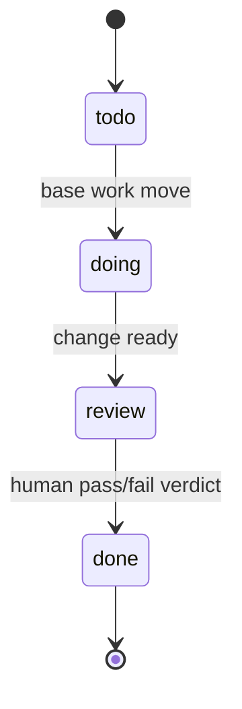

# Base documentation

The [project README](../README.md) covers installing Base and running your first pipeline. These
documents go deeper. Each answers one question:

| Document | Answers | Type |
|---|---|---|
| [SPEC.md](SPEC.md) | What is the shipped v0.2 architecture contract? | intent |
| [CANON.md](CANON.md) | How do I author each canon kind, pack, and native overlay? | reference |
| [ADAPTERS.md](ADAPTERS.md) | What surface and fidelity does each harness get? | reference |
| [UPGRADING.md](UPGRADING.md) | How do I migrate a Base v0.1 project to v0.2? | how-to |
| [DECISIONS.md](DECISIONS.md) | Why is Base built this way? | decision log |

**Intent docs** (SPEC, DECISIONS) sit upstream of the code — diverging from them is a recorded
decision, not a silent edit. **Reference docs** describe current behavior. **How-to docs** walk a
specific journey end to end.

## Suggested reading order

1. **[SPEC.md](SPEC.md)** — the ten-section contract: principles, composition, canon, adapters,
   state, gates, the CLI, and non-goals. Read this first to build the mental model.
2. **[CANON.md](CANON.md)** — the authoring reference. Frontmatter schemas and body rules for
   rules, agents, skills, pipelines, policies, verifiers, packs, and native overlays.
3. **[ADAPTERS.md](ADAPTERS.md)** — how each definition lands in Claude Code, Codex, and Copilot,
   and the fidelity vocabulary Base reports when a target cannot express something natively.
4. **[DECISIONS.md](DECISIONS.md)** — the append-only rationale behind every load-bearing choice,
   consult it when a design seems surprising.

## Concept primer: the work-item lifecycle

Work items (`.base/work/W-NNNN-slug/item.md`) move through a fixed four-state workflow. The final
transition to `done` requires an explicit human `pass | fail` verdict — Base never infers
completion from checked criteria.

Checked acceptance criteria are **evidence**, not the verdict. A local pass cannot prove unavailable
infrastructure or an external release gate — Base keeps `fail` and `inconclusive` as distinct
non-passing outcomes throughout. See [SPEC.md §5](SPEC.md) for the full state and evidence contract.
